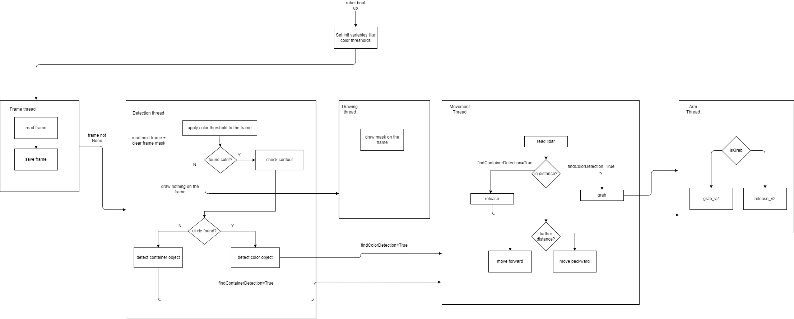
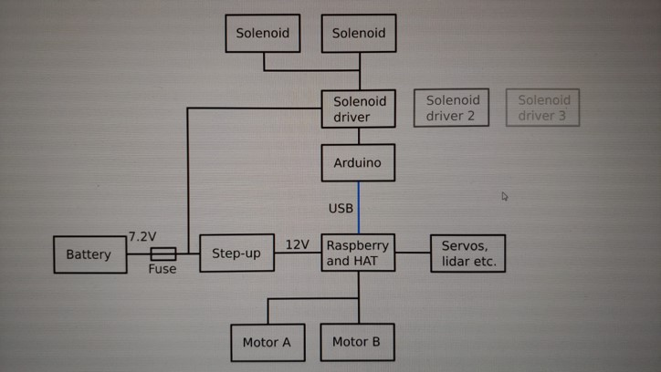

# Ties2022
## Updated v1
## What's next
- [ ] update Move.py
- [ ] update requirements-bulleye.txt

## Used Technologies
-	Hardware:
o	Raspberry Pi 4B+: main processor
o	Arduino: led + solenoid sub controller
o	Camera Module
o	Lidar Lite v3
o	Compass CMPS14
o	Micro and MG995 Servos
o	12V DC Motors
o	5V Solenoids
o	3D printing material
o	Bluetooth speaker
o	Led Strip WS2812
o	Voltage Stepper
o	Portable batteries
o	DRV8835 Pololu Motor Driver Shield
-	Software:
o	Python
o	Flask (video streaming)
o	OpenCV (color detection)
o	Adafruit Libraries (servos and motors control)
o	Adafruit Neopixel

## Flow Chart

## Schematics


## Setup
Some initial configurations are necessary to make before running the script
1. I2C check
    - Besides default I2C gpio 2,3 on raspberry pi
        - 3 => sda/scl 22/23
        - 4 => sda/scl 12/13
    - Configuration for them are automated by running setup.py
2. Bluetooth speaker
- It’s necessary to get the MAC address of the bluetooth device used and put it inside the btconnect.sh for automatic connection when robot powered on.
3. Arduino
- Arduino and Raspberry PI connection is via USB cable. In the arduino.ino, it controls solenoid patterns and LED color

4. Running setup.py to install and run app.py at booting up. The setup.py includes
-	Install the necessary python modules
-	Add I2C
-	Add app.py and btconnect.sh to etc/rc.local for automatic run
After this the robot is rebooted, when it boots up, the WLAN web interface is opened for clients to connect with the robot
```
    using browser to http://<raspi_ip>:5000
```
> run setup file
```
```python3
    python3 setup.py
```
> check your i2c config
```bash
    sudo i2cdetect -y 3
    sudo i2cdetect -y 4
```
> emergency stop
```bash
    sudo kill $(ps aux | grep //home/pi | awk '{print $2}')
```
## Competition results
- [Ytube](https://youtu.be/OIq7m0tXry4)
## Website
- [Go to gallery](https://komine.project.tamk.cloud/)
